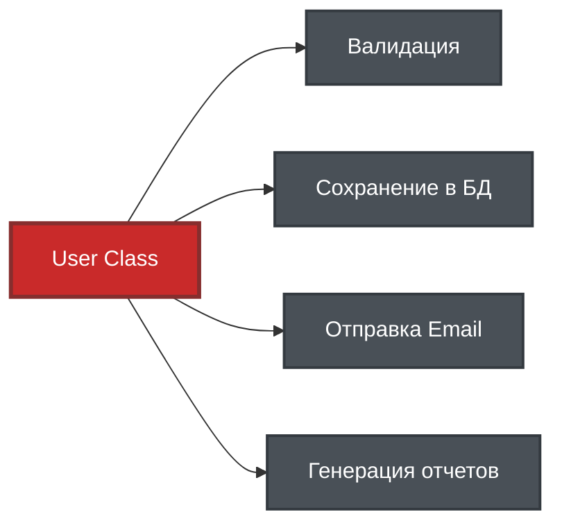
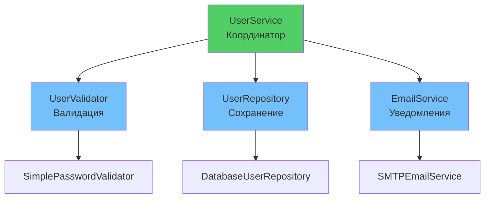

# 📋 Урок 2: Single Responsibility Principle (SRP)

## 🎯 Цели урока

После изучения этого урока вы сможете:

- ✅ Определять нарушения принципа единственной ответственности
- ✅ Разделять классы на компоненты с единственной ответственностью
- ✅ Создавать слабо связанные и высоко связные модули
- ✅ Применять SRP в реальных проектах

## 🚀 Мотивация: проблема "божественного" класса

### 📊 Визуализация проблемы



**Проблема**: Один класс делает слишком много! 💥

Представьте класс, который делает ВСЁ:

```python
class User:
    """❌ Класс-монстр, который нарушает SRP"""
    
    def __init__(self, name: str, email: str, password: str):
        self.name = name
        self.email = email
        self.password = password

    def save_to_database(self):
        """Сохраняет в БД"""
        print(f"SQL: INSERT INTO users...")

    def send_email(self, subject: str, message: str):
        """Отправляет email"""
        print(f"SMTP: Sending to {self.email}")

    def validate_password(self):
        """Валидирует пароль"""
        return len(self.password) >= 8

    def generate_report(self):
        """Генерирует отчет"""
        return f"Report for {self.name}"
```

**Проблемы:**

- 🔧 **4 разные ответственности** в одном классе
- 🐛 **Изменение БД** ломает email логику
- 🧪 **Невозможно тестировать** отдельные части
- 🔄 **Нельзя переиспользовать** валидацию в других местах

---

## 📖 Определение SRP

!!! quote "Принцип единственной ответственности"
    **Класс должен иметь только одну причину для изменения.**

### 💡 Простыми словами:

Представьте повара в ресторане:

- ❌ **Плохо**: Один повар готовит, моет посуду, принимает заказы и считает деньги
- ✅ **Хорошо**: Повар только готовит, официант принимает заказы, мойщик моет посуду

В программировании:

- **Одна ответственность = одна причина изменения**
- **Класс должен заниматься только одним делом**
- **Если класс делает A И B, разделите на два класса**

### 🎯 Как понять, что класс делает слишком много?

**Вопросы для самопроверки:**

1. Можете ли вы описать класс одним предложением? ("Этот класс...")
2. Если изменится БД, нужно ли менять логику email? (Если да - нарушение SRP)
3. Можно ли использовать часть класса отдельно? (Если нет - возможно нарушение)

### 🔍 Как определить ответственность?

**Правильные вопросы:**

1. **Что делает этот класс?** (главная функция)
2. **Почему он может измениться?** (причины для модификации) 
3. **Можно ли разделить логику?** (независимые части)

**Признаки нарушения SRP:**

- Класс имеет методы с разными префиксами (`save_`, `send_`, `validate_`), и т.д.
- Трудно дать классу короткое понятное имя
- Класс зависит от многих внешних систем (БД, email, API)

---

!!! note "Python Version"
    Примеры кода в этом разделе используют синтаксис PEP 604 (`Type | None`) и требуют **Python 3.10+**. 
    Если вы используете Python 3.9 или более раннюю версию, замените `Type | None` на `Optional[Type]` 
    и добавьте импорт: `from typing import Optional`.

## ✅ Правильное решение: разделение ответственностей

### Шаг 1: Выделяем данные

```python
from dataclasses import dataclass

@dataclass
class User:
    """✅ Только данные пользователя"""
    name: str
    email: str
    password: str
```

### Шаг 2: Создаем специализированные интерфейсы

```python
from typing import Protocol

class UserRepository(Protocol):
    """Протокол для работы с БД"""
    def save(self, user: User) -> None: ...
    def find_by_email(self, email: str) -> User | None: ...

class EmailService(Protocol):
    """Протокол для отправки email"""
    def send(self, to_email: str, subject: str, message: str) -> None: ...

class PasswordValidator(Protocol):
    """Протокол для валидации паролей"""
    def validate(self, password: str) -> bool: ...
```

### Шаг 3: Простые реализации

```python
class DatabaseUserRepository:
    """✅ Только работа с БД"""
    def save(self, user: User) -> None:
        # Упрощенная реализация взаимодействия с бд
        print(f"Saving {user.name} to database")
    
    def find_by_email(self, email: str) -> User | None:
        # Упрощенная реализация поиска в БД
        print(f"Found user {user.name} by {email}")
        return User

class SMTPEmailService:
    """✅ Только отправка email"""
    def send(self, to_email: str, subject: str, message: str) -> None:
        # Упрощенная реализация отправки по email
        print(f"Sending email to {to_email}: {subject}")

class SimplePasswordValidator:
    """✅ Только валидация паролей"""
    def validate(self, password: str) -> bool:
        # Упрощенная реализация валидации
        cond = len(password) >= 8 and any(c.isdigit() for c in password)
        if not cond:
            raise ValueError("Password too weak")
        return cond
```

### Шаг 4: Композиция сервисов

```python
class UserService:
    """✅ Бизнес-логика пользователей"""
    
    def __init__(
        self, 
        repository: UserRepository,
        email_service: EmailService, 
        password_validator: PasswordValidator
    ):
        self.repository = repository
        self.email_service = email_service
        self.password_validator = password_validator

    def create_user(self, name: str, email: str, password: str) -> User:
        """Создает пользователя с валидацией"""
        self.password_validator.validate(password)
        user = User(name=name, email=email, password=password)
        self.repository.save(user)
        self.email_service.send(email, "Welcome!", f"Hello, {name}!")
        return user

# Использование
user_service = UserService(
    repository=DatabaseUserRepository(),
    email_service=SMTPEmailService(),
    password_validator=SimplePasswordValidator()
)

user = user_service.create_user("Alice", "alice@example.com", "secure123")
```

### 📊 Архитектура после рефакторинга



---

## 📊 Преимущества SRP

### ✅ **1. Легкое тестирование**
```python
@pytest.mark.parametrize(
    "value, expected",
    [
        ("weak", False),
        ("strong123", True)
    ]
)
def test_password_validator(value: str, expected: bool) -> None:
    validator = SimplePasswordValidator()
    assert validator.validate(value) == expected
```

### ✅ **2. Повторное использование**
```python
# Валидатор можно использовать в других местах
admin_service = AdminService(password_validator=SimplePasswordValidator())
api_service = APIService(email_service=SMTPEmailService())
```

### ✅ **3. Легкая замена реализаций**
```python
# Легко поменять на другой email сервис
user_service = UserService(
    repository=DatabaseUserRepository(),
    email_service=SlackNotificationService(),  # Вместо SMTP
    password_validator=StrongPasswordValidator()  # Усиленная валидация
)
```

---

## 🎯 Когда применять SRP?

### ✅ **Применяйте SRP когда:**
- Класс имеет **более 5-7 методов**
- Методы работают с **разными данными**
- **Трудно дать имя** классу
- Класс **зависит от многих** внешних систем

### ⚠️ **SRP может быть избыточным:**
- **Простые DTO** (Data Transfer Objects)
- **Утилитарные классы** с 1-2 методами
- **Конфигурационные классы**
- **Прототипы** и MVP проекты

---

## 🎯 Ключевые выводы

1. **SRP = одна причина для изменения**
2. **Разделение ответственностей улучшает архитектуру**
3. **Маленькие классы легче тестировать и переиспользовать**
4. **Протоколы помогают создавать гибкие системы**
5. **Применяйте разумно - не создавайте класс для каждого метода**

## 🚀 Следующие шаги

!!! success "Что вы узнали"
    - ✅ Класс должен иметь только одну причину для изменения
    - ✅ Разделение ответственностей улучшает тестируемость и поддерживаемость
    - ✅ Использование протоколов делает код гибким

!!! tip "Практика"
    Найдите в своем проекте класс, который делает больше одной вещи. Попробуйте разделить его на несколько классов с единственной ответственностью.

Теперь вы готовы изучить **[Принцип открытости/закрытости](03-open-closed.md)** - как создавать расширяемый код без изменения существующего!

---

!!! tip "Практический совет"
    Начните с анализа одного "проблемного" класса в вашем проекте. Задайте себе вопрос: "За что отвечает этот класс?" Если ответов больше одного - пора рефакторить!

## 🧪 Проверьте свои знания: SRP

<div class="quiz-container" id="srp-quiz">
<script type="application/json">
{
  "title": "Single Responsibility Principle",
  "description": "Проверьте понимание принципа единственной ответственности",
  "icon": "📋",
  "questions": [
    {
      "question": "Что означает принцип единственной ответственности (SRP)?",
      "type": "single",
      "points": 1,
      "options": [
        {"text": "Класс должен иметь только один метод", "correct": false},
        {"text": "Класс должен иметь только одну причину для изменения", "correct": true},
        {"text": "Класс должен наследоваться только от одного класса", "correct": false},
        {"text": "Класс должен работать только с одним типом данных", "correct": false}
      ],
      "explanation": "SRP означает, что класс должен иметь только одну причину для изменения"
    },
    {
      "question": "Какой код нарушает SRP?",
      "type": "single",
      "points": 1,
      "code": "class UserManager:\n    def create_user(self): pass\n    def save_to_db(self): pass\n    def send_email(self): pass\n    def validate_password(self): pass",
      "options": [
        {"text": "Класс имеет слишком много ответственностей", "correct": true},
        {"text": "Класс использует неправильные имена методов", "correct": false},
        {"text": "Класс слишком маленький", "correct": false},
        {"text": "Класс не использует типизацию", "correct": false}
      ],
      "explanation": "UserManager отвечает за создание, сохранение, email и валидацию - это 4 разные ответственности"
    },
    {
      "question": "Какие преимущества дает соблюдение SRP?",
      "type": "multiple",
      "points": 2,
      "options": [
        {"text": "Улучшенная тестируемость", "correct": true},
        {"text": "Повторное использование кода", "correct": true},
        {"text": "Увеличение производительности", "correct": false},
        {"text": "Легкость изменений", "correct": true},
        {"text": "Уменьшение количества файлов", "correct": false}
      ],
      "explanation": "SRP улучшает тестируемость, переиспользование и упрощает внесение изменений"
    },
    {
      "question": "Как определить, что класс нарушает SRP?",
      "type": "single", 
      "points": 1,
      "options": [
        {"text": "У класса больше 10 методов", "correct": false},
        {"text": "Трудно дать классу короткое понятное имя", "correct": true},
        {"text": "Класс не использует наследование", "correct": false},
        {"text": "Класс имеет приватные методы", "correct": false}
      ],
      "explanation": "Если трудно кратко назвать класс, он скорее всего делает слишком много"
    },
    {
      "question": "Когда SRP может быть избыточным?",
      "type": "single",
      "points": 1,
      "options": [
        {"text": "В больших проектах", "correct": false},
        {"text": "При работе с базами данных", "correct": false}, 
        {"text": "Для простых DTO классов", "correct": true},
        {"text": "При использовании фреймворков", "correct": false}
      ],
      "explanation": "Для простых DTO (Data Transfer Objects) разделение может быть избыточным"
    }
  ]
}
</script>
</div>

## 💻 Интерактивные упражнения

Попробуйте решить все задачи прямо в браузере! Каждое упражнение проверяет ваше понимание SRP на практике.

### Упражнение 1: Рефакторинг UserService

**Задача:** Класс `UserService` нарушает принцип единственной ответственности, так как выполняет валидацию, работу с базой данных и отправку email. Необходимо провести рефакторинг.

**Исходный код с проблемой:**

```python
class UserService:
    def create_user(self, user_data):
        # 1. Валидация данных
        if not self._validate_data(user_data):
            raise ValueError("Invalid data")
        
        # 2. Создание пользователя
        user = User(**user_data)
        
        # 3. Сохранение в БД
        self._save_to_db(user)
        
        # 4. Отправка email
        self._send_welcome_email(user)
        
        return user
    
    def _validate_data(self, data):
        """
        Validates user data structure and content.
        
        Checks:
        - Required fields present: 'name', 'email', 'password'
        - Name: not empty, length 2-50 characters
        - Email: valid format (contains @ and domain)
        - Password: minimum 8 characters, contains digit
        
        Args:
            data: dict with keys 'name', 'email', 'password'
        Returns:
            bool: True if valid, False otherwise
        """
        import re
        
        if not all(k in data for k in ['name', 'email', 'password']):
            return False
        
        # Validate name
        if not data['name'] or len(data['name']) < 2 or len(data['name']) > 50:
            return False
        
        # Validate email format
        email_pattern = r'^[a-zA-Z0-9._%+-]+@[a-zA-Z0-9.-]+\.[a-zA-Z]{2,}$'
        if not re.match(email_pattern, data['email']):
            return False
        
        # Validate password strength
        if len(data['password']) < 8 or not any(c.isdigit() for c in data['password']):
            return False
        
        return True
    
    def _save_to_db(self, user):
        """
        Saves user to database.
        
        Example implementation using SQLite:
        - Connects to database
        - Executes INSERT query
        - Commits transaction
        - Handles duplicates
        
        In production would use ORM (SQLAlchemy, Django ORM) or 
        connection pool for better performance.
        """
        import sqlite3
        
        conn = sqlite3.connect('users.db')
        cursor = conn.cursor()
        
        try:
            cursor.execute('''
                INSERT INTO users (name, email, password)
                VALUES (?, ?, ?)
            ''', (user.name, user.email, user.password))
            conn.commit()
        except sqlite3.IntegrityError:
            raise ValueError(f"User with email {user.email} already exists")
        finally:
            conn.close()
    
    def _send_welcome_email(self, user):
        """
        Sends welcome email to new user.
        
        Example implementation using SMTP:
        - Connects to SMTP server
        - Authenticates
        - Sends formatted email
        - Handles errors
        
        In production would use email service (SendGrid, AWS SES)
        or task queue (Celery) for async processing.
        """
        import smtplib
        from email.mime.text import MIMEText
        
        msg = MIMEText(f'''
        Welcome to our platform, {user.name}!
        
        Your account has been successfully created.
        Email: {user.email}
        
        Best regards,
        Team
        ''')
        
        msg['Subject'] = 'Welcome!'
        msg['From'] = 'noreply@example.com'
        msg['To'] = user.email
        
        try:
            with smtplib.SMTP('smtp.gmail.com', 587) as server:
                server.starttls()
                server.login('your_email@gmail.com', 'your_password')
                server.send_message(msg)
        except Exception as e:
            print(f"Failed to send email: {e}")
```

**Проблемы этого подхода:**

- ❌ `UserService` знает о структуре БД, SMTP-сервере, форматах email, регулярных выражениях
- ❌ Невозможно протестировать создание пользователя без реальной БД и SMTP
- ❌ Нельзя переиспользовать валидацию email в других местах (регистрация админа, изменение email)
- ❌ Изменение способа валидации требует изменения `UserService`
- ❌ Замена SQLite на PostgreSQL или замена SMTP на SendGrid требует изменения этого класса

**Что нужно сделать:**

1. Проанализируйте исходный класс и определите все его ответственности
2. Создайте отдельные протоколы для каждой ответственности
3. Реализуйте конкретные классы для каждого протокола
4. Перепишите `UserService` как координатор, который использует созданные сервисы через dependency injection

**Требования к решению:**

- Использовать `Protocol` для определения интерфейсов
- Каждый класс должен иметь одну четко определенную ответственность
- `UserService` должен принимать зависимости через конструктор

{{ code_input_form(
    exercise_id="srp_refactoring_01",
    initial_code="from typing import Protocol\nfrom dataclasses import dataclass\n\n@dataclass\nclass User:\n    name: str\n    email: str\n    password: str\n\n# Ваш код здесь:\n",
    placeholder="Создайте классы с единственной ответственностью...",
    use_pyodide=True,
    test_cases=[
        {
            "code": "assert 'UserValidator' in globals(), '❌ Не найден класс UserValidator. Создайте протокол для валидации данных пользователя.'",
            "description": "Проверка существования UserValidator"
        },
        {
            "code": "assert 'UserRepository' in globals(), '❌ Не найден класс UserRepository. Создайте протокол для работы с базой данных.'",
            "description": "Проверка существования UserRepository"
        },
        {
            "code": "assert 'EmailService' in globals(), '❌ Не найден класс EmailService. Создайте протокол для отправки email уведомлений.'",
            "description": "Проверка существования EmailService"
        },
        {
            "code": "import inspect; assert 'UserValidator' in globals() and (inspect.isclass(UserValidator) and hasattr(UserValidator, 'validate')), '❌ UserValidator должен иметь метод validate для проверки данных.'",
            "description": "Проверка метода validate в UserValidator"
        },
        {
            "code": "import inspect; assert 'UserRepository' in globals() and (inspect.isclass(UserRepository) and hasattr(UserRepository, 'save')), '❌ UserRepository должен иметь метод save для сохранения пользователей в БД.'",
            "description": "Проверка метода save в UserRepository"
        },
        {
            "code": "import inspect; assert 'EmailService' in globals() and (inspect.isclass(EmailService) and hasattr(EmailService, 'send')), '❌ EmailService должен иметь метод send для отправки email.'",
            "description": "Проверка метода send в EmailService"
        },
        {
            "code": "assert 'UserService' in globals(), '❌ Не найден класс UserService. Создайте координатор, который использует все сервисы.'",
            "description": "Проверка существования координатора UserService"
        },
        {
            "code": "import inspect; service = UserService if 'UserService' in globals() else None; assert service and hasattr(service, '__init__'), '❌ UserService должен иметь конструктор для принятия зависимостей.'",
            "description": "Проверка конструктора UserService"
        },
        {
            "code": "import inspect; service = UserService if 'UserService' in globals() else None; sig = inspect.signature(service.__init__) if service else None; assert sig and len(sig.parameters) >= 3, '❌ UserService должен принимать минимум 3 зависимости через конструктор (validator, repository, email_service).'",
            "description": "Проверка параметров конструктора"
        }
    ]
) }}

??? tip "Подсказка"
    Используйте Protocol для создания интерфейсов, а затем реализуйте конкретные классы. UserService должен принимать эти зависимости через конструктор (Dependency Injection).

### Упражнение 2: Рефакторинг OrderProcessor

**Задача:** Метод `process_order` выполняет слишком много разнородных операций: работает с базой данных, обрабатывает платежи, управляет складом и отправляет уведомления. Это классический пример нарушения SRP.

**Исходный код с проблемой:**

```python
class OrderProcessor:
    def process_order(self, order_data):
        # Валидация заказа
        # Сохранение в БД  
        # Обработка платежа
        # Отправка email
        # Обновление склада
        pass
```

**Что нужно сделать:**

1. Определите все ответственности класса `OrderProcessor` (посчитайте комментарии)
2. Создайте отдельный протокол для каждой операции
3. Реализуйте конкретные классы для каждого протокола
4. Реорганизуйте `OrderProcessor` как координирующий класс

**Требования к решению:**

- Минимум 5 отдельных классов ответственности
- Использование Protocol для определения контрактов
- OrderProcessor координирует работу всех сервисов
- Каждый класс отвечает только за одну область

{{ code_input_form(
    exercise_id="srp_order_processor",
    initial_code="from typing import Protocol\nfrom dataclasses import dataclass\n\n@dataclass\nclass Order:\n    order_id: str\n    amount: float\n    customer_email: str\n\n# Ваш рефакторинг здесь:\n",
    placeholder="Создайте отдельные классы для каждой ответственности...",
    use_pyodide=True,
    test_cases=[
        {
            "code": "assert 'OrderValidator' in globals(), '❌ Не найден класс OrderValidator. Создайте протокол для валидации заказов.'",
            "description": "Проверка существования OrderValidator"
        },
        {
            "code": "assert 'OrderRepository' in globals(), '❌ Не найден класс OrderRepository. Создайте протокол для сохранения заказов в БД.'",
            "description": "Проверка существования OrderRepository"
        },
        {
            "code": "assert 'PaymentProcessor' in globals(), '❌ Не найден класс PaymentProcessor. Создайте протокол для обработки платежей.'",
            "description": "Проверка существования PaymentProcessor"
        },
        {
            "code": "assert 'EmailNotifier' in globals(), '❌ Не найден класс EmailNotifier. Создайте протокол для отправки email уведомлений.'",
            "description": "Проверка существования EmailNotifier"
        },
        {
            "code": "assert 'InventoryManager' in globals(), '❌ Не найден класс InventoryManager. Создайте протокол для управления складом.'",
            "description": "Проверка существования InventoryManager"
        },
        {
            "code": "import inspect; assert 'OrderValidator' in globals() and hasattr(OrderValidator, 'validate'), '❌ OrderValidator должен иметь метод validate для проверки заказов.'",
            "description": "Проверка метода validate"
        },
        {
            "code": "import inspect; assert 'OrderRepository' in globals() and hasattr(OrderRepository, 'save'), '❌ OrderRepository должен иметь метод save для сохранения заказов.'",
            "description": "Проверка метода save"
        },
        {
            "code": "import inspect; assert 'PaymentProcessor' in globals() and hasattr(PaymentProcessor, 'process_payment'), '❌ PaymentProcessor должен иметь метод process_payment для обработки платежей.'",
            "description": "Проверка метода process_payment"
        },
        {
            "code": "import inspect; assert 'EmailNotifier' in globals() and hasattr(EmailNotifier, 'send_notification'), '❌ EmailNotifier должен иметь метод send_notification для отправки уведомлений.'",
            "description": "Проверка метода send_notification"
        },
        {
            "code": "import inspect; assert 'InventoryManager' in globals() and hasattr(InventoryManager, 'update_stock'), '❌ InventoryManager должен иметь метод update_stock для обновления склада.'",
            "description": "Проверка метода update_stock"
        },
        {
            "code": "assert 'OrderProcessor' in globals(), '❌ Не найден класс OrderProcessor. Создайте координатор для оркестрации всех сервисов.'",
            "description": "Проверка существования координатора"
        },
        {
            "code": "import inspect; service = OrderProcessor if 'OrderProcessor' in globals() else None; sig = inspect.signature(service.__init__) if service and hasattr(service, '__init__') else None; assert sig and len(sig.parameters) >= 5, '❌ OrderProcessor должен принимать минимум 5 зависимостей через конструктор.'",
            "description": "Проверка dependency injection"
        }
    ]
) }}

??? tip "Подсказка"
    Посчитайте комментарии в методе `process_order` - каждый комментарий указывает на отдельную ответственность. Создайте Protocol и реализацию для каждой из них.

### Упражнение 3: Рефакторинг FileManager

**Задача:** Класс `FileManager` объединяет операции ввода-вывода, сжатия, шифрования и работы с облаком. Каждая из этих операций является отдельной ответственностью и должна быть выделена.

**Исходный код с проблемой:**

```python
class FileManager:
    def read_file(self, filename): pass
    def write_file(self, filename, content): pass  
    def compress_file(self, filename): pass
    def encrypt_file(self, filename, key): pass
    def upload_to_cloud(self, filename): pass
```

**Что нужно сделать:**

1. Выделите каждый метод `FileManager` в отдельную область ответственности
2. Создайте протоколы для каждого типа операций с файлами
3. Реализуйте конкретные классы для каждого протокола
4. Создайте новый FileManager, который использует композицию этих сервисов

**Требования к решению:**

- Отдельные протоколы для чтения, записи, сжатия, шифрования и загрузки
- Конкретные реализации для каждого протокола
- FileManager как фасад, делегирующий операции специализированным классам
- Возможность легко заменять реализации (например, разные алгоритмы сжатия)

{{ code_input_form(
    exercise_id="srp_file_manager",
    initial_code="from typing import Protocol\n\n# Ваш рефакторинг здесь:\n",
    placeholder="Создайте протоколы и конкретные реализации...",
    use_pyodide=True,
    test_cases=[
        {
            "code": "assert 'FileReader' in globals(), '❌ Не найден класс FileReader. Создайте протокол для чтения файлов.'",
            "description": "Проверка существования FileReader"
        },
        {
            "code": "assert 'FileWriter' in globals(), '❌ Не найден класс FileWriter. Создайте протокол для записи файлов.'",
            "description": "Проверка существования FileWriter"
        },
        {
            "code": "assert 'FileCompressor' in globals(), '❌ Не найден класс FileCompressor. Создайте протокол для сжатия файлов.'",
            "description": "Проверка существования FileCompressor"
        },
        {
            "code": "assert 'FileEncryptor' in globals(), '❌ Не найден класс FileEncryptor. Создайте протокол для шифрования файлов.'",
            "description": "Проверка существования FileEncryptor"
        },
        {
            "code": "assert 'CloudUploader' in globals(), '❌ Не найден класс CloudUploader. Создайте протокол для загрузки в облако.'",
            "description": "Проверка существования CloudUploader"
        },
        {
            "code": "import inspect; assert 'FileReader' in globals() and hasattr(FileReader, 'read'), '❌ FileReader должен иметь метод read для чтения файлов.'",
            "description": "Проверка метода read"
        },
        {
            "code": "import inspect; assert 'FileWriter' in globals() and hasattr(FileWriter, 'write'), '❌ FileWriter должен иметь метод write для записи файлов.'",
            "description": "Проверка метода write"
        },
        {
            "code": "import inspect; assert 'FileCompressor' in globals() and hasattr(FileCompressor, 'compress'), '❌ FileCompressor должен иметь метод compress для сжатия файлов.'",
            "description": "Проверка метода compress"
        },
        {
            "code": "import inspect; assert 'FileEncryptor' in globals() and hasattr(FileEncryptor, 'encrypt'), '❌ FileEncryptor должен иметь метод encrypt для шифрования файлов.'",
            "description": "Проверка метода encrypt"
        },
        {
            "code": "import inspect; assert 'CloudUploader' in globals() and hasattr(CloudUploader, 'upload'), '❌ CloudUploader должен иметь метод upload для загрузки в облако.'",
            "description": "Проверка метода upload"
        },
        {
            "code": "assert 'FileManager' in globals(), '❌ Не найден класс FileManager. Создайте координатор, который использует все файловые сервисы.'",
            "description": "Проверка существования координатора"
        },
        {
            "code": "import inspect; manager = FileManager if 'FileManager' in globals() else None; sig = inspect.signature(manager.__init__) if manager and hasattr(manager, '__init__') else None; assert sig and len(sig.parameters) >= 5, '❌ FileManager должен принимать минимум 5 зависимостей (reader, writer, compressor, encryptor, uploader) через конструктор.'",
            "description": "Проверка dependency injection в FileManager"
        }
    ]
) }}

??? tip "Подсказка"
    Каждый метод исходного класса должен превратиться в отдельный протокол. Например: `read_file` → `FileReader(Protocol)` → `LocalFileReader`. FileManager должен принимать все эти сервисы и делегировать им вызовы.

### Упражнение 4: Система интернет-магазина

**Задача:** Спроектируйте архитектуру e-commerce системы с нуля, применяя принцип единственной ответственности. Система должна управлять товарами, заказами, платежами и уведомлениями.

**Доменная модель:**

```python
@dataclass
class Product:
    product_id: str
    name: str
    price: Decimal
    stock: int

@dataclass
class Order:
    order_id: str
    product_id: str
    quantity: int
    total: Decimal
```

**Что нужно сделать:**

1. Выделите 4 основных бизнес-домена интернет-магазина
2. Создайте протокол для каждого бизнес-домена
3. Реализуйте конкретные классы (минимум 2 реализации для платежей и уведомлений)
4. Создайте координирующий класс ECommerceSystem, объединяющий все сервисы
5. Реализуйте метод оформления заказа, использующий все сервисы

**Требования к решению:**

- 4 протокола для разных доменов (товары, заказы, платежи, уведомления)
- Минимум 6 конкретных реализаций (по 1 для товаров и заказов, по 2 для платежей и уведомлений)
- ECommerceSystem координирует работу всех сервисов через dependency injection
- Продемонстрируйте гибкость: легкую замену реализаций (например, Stripe на PayPal)

{{ code_input_form(
    exercise_id="srp_ecommerce_system",
    initial_code="from typing import Protocol\nfrom dataclasses import dataclass\nfrom decimal import Decimal\n\n@dataclass\nclass Product:\n    product_id: str\n    name: str\n    price: Decimal\n    stock: int\n\n@dataclass\nclass Order:\n    order_id: str\n    product_id: str\n    quantity: int\n    total: Decimal\n\n# Ваш код здесь:\n",
    placeholder="Создайте сервисы для e-commerce системы...",
    use_pyodide=True,
    test_cases=[
        {
            "code": "assert 'ProductService' in globals(), '❌ Не найден протокол ProductService. Создайте протокол для управления товарами.'",
            "description": "Проверка существования ProductService"
        },
        {
            "code": "assert 'OrderService' in globals(), '❌ Не найден протокол OrderService. Создайте протокол для обработки заказов.'",
            "description": "Проверка существования OrderService"
        },
        {
            "code": "assert 'PaymentService' in globals(), '❌ Не найден протокол PaymentService. Создайте протокол для обработки платежей.'",
            "description": "Проверка существования PaymentService"
        },
        {
            "code": "assert 'NotificationService' in globals(), '❌ Не найден протокол NotificationService. Создайте протокол для отправки уведомлений.'",
            "description": "Проверка существования NotificationService"
        },
        {
            "code": "import inspect; assert 'ProductService' in globals() and hasattr(ProductService, 'get_product'), '❌ ProductService должен иметь метод get_product для получения информации о товаре.'",
            "description": "Проверка метода get_product"
        },
        {
            "code": "import inspect; assert 'OrderService' in globals() and hasattr(OrderService, 'create_order'), '❌ OrderService должен иметь метод create_order для создания заказа.'",
            "description": "Проверка метода create_order"
        },
        {
            "code": "import inspect; assert 'PaymentService' in globals() and hasattr(PaymentService, 'process_payment'), '❌ PaymentService должен иметь метод process_payment для обработки платежей.'",
            "description": "Проверка метода process_payment"
        },
        {
            "code": "import inspect; assert 'NotificationService' in globals() and hasattr(NotificationService, 'send_notification'), '❌ NotificationService должен иметь метод send_notification для отправки уведомлений.'",
            "description": "Проверка метода send_notification"
        },
        {
            "code": "payment_implementations = [name for name in globals() if 'Payment' in name and name != 'PaymentService' and inspect.isclass(globals()[name])]; assert len(payment_implementations) >= 2, f'❌ Создайте минимум 2 реализации PaymentService (например, StripePaymentProcessor, PayPalProcessor). Найдено: {len(payment_implementations)}'",
            "description": "Проверка множественных реализаций для платежей"
        },
        {
            "code": "notification_implementations = [name for name in globals() if 'Notification' in name or 'Notifier' in name or 'Email' in name or 'Slack' in name and name != 'NotificationService' and inspect.isclass(globals()[name])]; assert len(notification_implementations) >= 2, f'❌ Создайте минимум 2 реализации NotificationService (например, EmailNotifier, SlackNotifier). Найдено: {len(notification_implementations)}'",
            "description": "Проверка множественных реализаций для уведомлений"
        },
        {
            "code": "assert 'ECommerceSystem' in globals(), '❌ Не найден класс ECommerceSystem. Создайте координатор для оркестрации всех сервисов.'",
            "description": "Проверка существования координатора"
        },
        {
            "code": "import inspect; system = ECommerceSystem if 'ECommerceSystem' in globals() else None; sig = inspect.signature(system.__init__) if system and hasattr(system, '__init__') else None; assert sig and len(sig.parameters) >= 4, '❌ ECommerceSystem должен принимать минимум 4 зависимости (product_service, order_service, payment_service, notification_service) через конструктор.'",
            "description": "Проверка dependency injection в ECommerceSystem"
        },
        {
            "code": "import inspect; system = ECommerceSystem if 'ECommerceSystem' in globals() else None; assert system and (hasattr(system, 'place_order') or hasattr(system, 'create_order') or hasattr(system, 'process_order')), '❌ ECommerceSystem должен иметь метод для оформления заказа (place_order, create_order или process_order).'",
            "description": "Проверка метода оформления заказа"
        }
    ]
) }}

??? tip "Подсказка"
    Типичные операции: ProductService (получить товар, проверить наличие), OrderService (создать заказ), PaymentService (обработать платеж), NotificationService (отправить уведомление). Для платежей и уведомлений создайте альтернативные реализации.